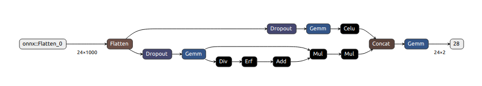

В рамках тестового задания я познакомился с данными по ЭЭГ. Пока не разбирался, что же они означают в реальной жизни. Видимо импульсы измеряются в 500 точках и имеют 2 канала. Плюс и минус, как в электричестве. Прошу не возмущаться - это просто догадка)

**Исследование** начал с построения картинок(eda.ipynb). На первый взгляд казалось, что всё очень просто - разные фазы объясняются разной дисперсией.
Можно, например, посчитать скользящую волатильность по окну и всё. Однако, сама формулировка задачи и тестовые данные внесли поправки. Во-первых, на обучении дикий дисбаланс классов в пользу бордствования. На тесте баланс классов наоборот 50 на 50. Плюс у каждого человека своя динамика ЭЭГ и логично, что тестовые люди не представлены в обучающей выборке. А у некоторых тестовых людей может оказаться вообще только 1 класс.

**Валидация**: особенность в том, что на валидации используются данные других людей(сплит по людям), поэтому ситуация теста эмулируется.

**Обучение бустинга.**(catboost_baseline) Бустинг - очень простая модель, которую не тюня можно сразу получить неплохой результат. Единственная проблема, которую надо было решить - это дисбаланс классов. Что корректируется параметром *scale_pos_weight*. Получились отличные результаты на валидации. И... На тесте вообще ничего не работало. Сначала я проверял нет ли лика в кросс-валидации, но оказалось, что у данных на тесте совсем другое распределение. Бустинг самоучит правила "*if x>a*". По понятным причинам, если масштаб тестовых данных примерно в 50 раз меньше, то все правила сразу перестаю адекватно работать(с домножением на 50 начинают). Но конечно, волшебная цифра 50 - это не решение ML задачи. Самый простой способ - потерять всю информацию об исторической волатильности и работать только с соотношением показателей. Шал понятен - нормируе все вектора(горизонтально). Модель обучилась, чуть-чуть настроив лёрнинг рейт, бейзлайн пробился с огромным запасом.

Задача решена. Но решено ли тестовое задание? По факту проведён один эксперимент. Но он совсем не приближает нас к нужно задаче EEG backbone. Да, я решил обучить простую нейронку и сравнить результаты.

**Обучение NN.**(cnn_baseline) Концепцию кода решил максимально совместить с бустингом, чтобы сравнить результаты. Был реализован простенький класс датасет, где в качестве дополнительного препроцессинга появляется скалер. Как только мы переходим к линейным моделям нам становится важен ещё и масштаб признаков. В качестве лосса взял классическую кросс-энтропию с двумя классами, чтобы было удобно добавить веса, аналогично тому, что в бустинге. Всякие шедулеры и т.д. - это тюнинг, поэтому классический AdamW с небольшим обучающим шагом.

**Архитектура.** Тут интересно. Однослойная нейронка не пробивала бейзлайн. Двухслойная нейронка быстро переучивалась. Третий слой понятное дело приводил к ещё более быстрому переобучению. Из явных проблем у модели можно было отметить сильную неставильность в резульатах, т.е. часто случались локальные минимумы из которых не получилось выбраться. Это потому что фичей многовато. Однако их чистка - это совсем другая и отдельная задача. Я попробовал добавить что-то вроде аттеншена(параллельный линейный слой с сигмоид нелинейностью и последующее их произведение Адамара, но на самом деле, когда у нас по факту у тензора только одна размерность это результатов не дало. Зато помогло просто добавление параллельного слоя, идентичному первому(чуть другая нелинейность) и последующая конкатенация. Можно сказать, что это внутренний стакинг моделей. Соотвественно результаты стали лучше и стабильнее. Но плохо, что эти скоррелированные слои очень похожи. Надо было каким-то образом разнести их веса и пространство решений. В итоге я выбрал input_dropout. Точнее для каждого из параллельного линейного слоя свой дропаут. Отлично, теперь есть уверенность, что они получились разными, а модель стала лучше и стабильнее(множественное тестирование не проводил).

**Вывод** Бустинг > NN. Но на самом деле это просто объясняется тем, что данные получились с dim=1. Следующим шагом по идее и должен быть переход к фичам по окнам небольшой ширины. Тут сразу есть особенность, что ширина долна быть маленькой, т.к. пердиоды 4 на трейне короткие. Когда мы делаем этот шаг, сразу встаёт вопрос - можно ли как-то иначе нормировать данные, чтобы не терять столько информации. Да, данные в таком случае было бы гораздо полезнее нормировать по этому мини-окну(не путать с мини-батчем - это другое).

**Бустинг** Отбираем топ фичей. Берём tsfresh для мини окна и снова отбираем топ фичей.

**NN** Берём мини окна, а это то же самое что тексты заданной длины, и вот тут открывается полёт фантазий. RNN, CNN, Self-Attention. А ещё у нейронок есть фича - можно же делать трансфер лёрнинг. Будем решать такую задачу(Bert-Like). Во-первых, добавляем эмбединг пользователя. А во-вторых, решаем задачу предсказания эмбединга(вектора), который находится в середине окна. Кажется, что подобный подход может помочь в том, что на тесте другое распределение, ведь для теста будут обучены свои эмбединги пользователей(человеков).

PS. Когда разбирался почему так сильно отличаются распределения, нашёл [статью](https://arxiv.org/pdf/1904.10255.pdf).
